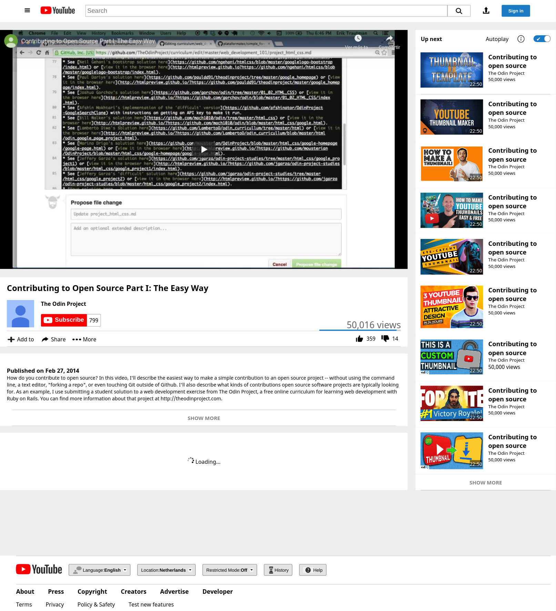

# youtube-clone

> This is a youtube clone project from microverse.

This is a youtube clone made from scratch.

## Built With

- Html,
- Css,
- Git

To get a local copy up and running follow these simple example steps.

### Usage

Open index.html

## Authors

👤 **Author1**

- Github: [@githubhandle](https://github.com/thedekerone)
- Twitter: [@twitterhandle](https://twitter.com/mauricio_fow)
- Linkedin: [linkedin](https://www.linkedin.com/in/mauricio-fow-aranibar-b2173514b/)

👤 **Author2**

- Github: [@githubhandle](https://github.com/misterpaul4)
- Twitter: [@twitterhandle](https://twitter.com/paulajuze)
- Linkedin: [linkedin](https://www.linkedin.com/in/chukwuebuka-paul-ajuizeogu/)

## 🤝 Contributing

Contributions, issues and feature requests are welcome!

Feel free to check the [issues page](issues/).

## Show your support

Give a ⭐️ if you like this project!

## 📝 License

This project is [MIT](lic.url) licensed.
